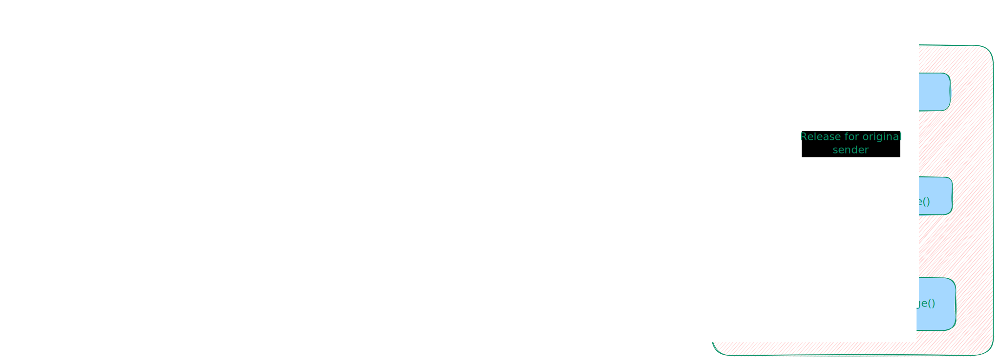

# Seft-hosting Avlanche L1 Chains PoC

**The [Avalanche](https://subnets.avax.network/validators/dashboard/) Self-Hosting L1 Deploy + Cross Chain Messaging / Token Transfer PoC.**

## Features

- [x] Deploy Multi Self-Hosting Avalanche L1 Chains on Container.
- [x] Transfer native tokens from multi self-hosting Avalanche L1 chains and view balances in Metamask.
- [x] Deploy the [`MyGamesNft`](./src/MyGamesNft.sol) contract to Self-Hosting Avalanche L1 Chain `MyGames1` and Mint Transfer Verification.
- [x] Deploy the [`MyGamesToken`](./src/MyGamesToken.sol) contract to Self-Hosting Avalanche L1 Multi Chain `MyGames1` and `MyGames2` and Transfer Verification.
- [x] Transfer ERC20 tokens from `MyGames1` **Cross-chain** to self-hosted Avalanche L1 `MyGames2` based on [`AWM/ICM/Teleporter`](https://github.com/ava-labs/icm-contracts/tree/main/contracts/teleporter).

## Architecture of Cross-Chain Messaging / Token Transfer

## Quick Start

- [Deployment of Avalanche L1 Multi Chains + Mint NFT + ERC20 Token Cross-Chain Bridge Transfer](./docs/1.Deploy-L1+Mint-NFT+ERC20+CrossChain-Bridge-Transfer.md)
