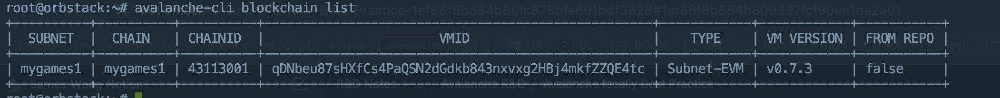
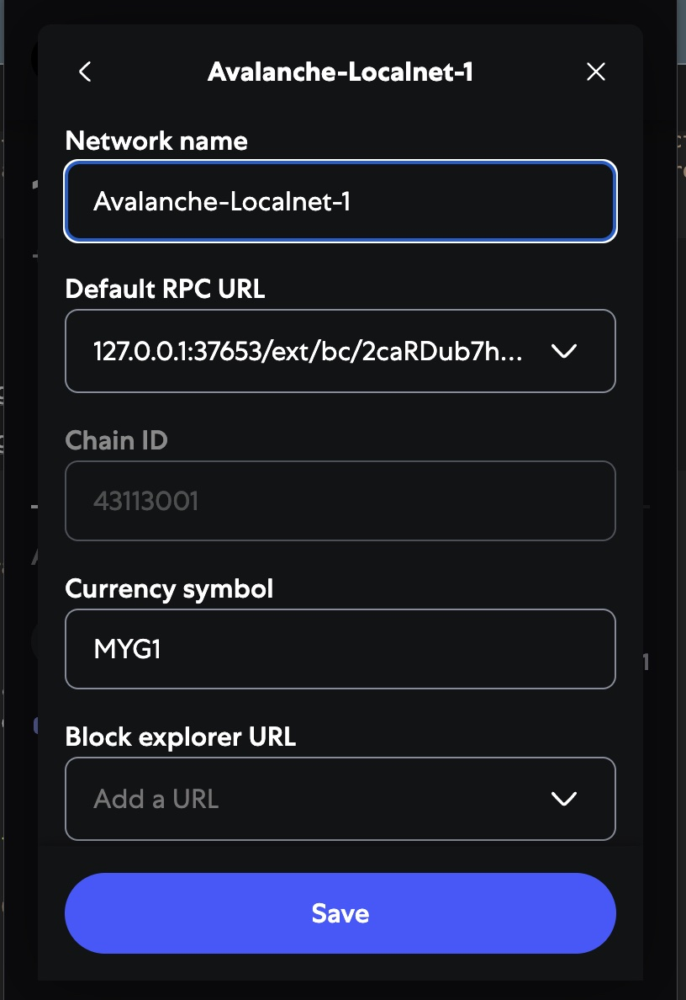
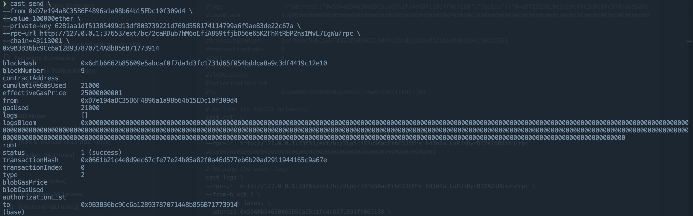
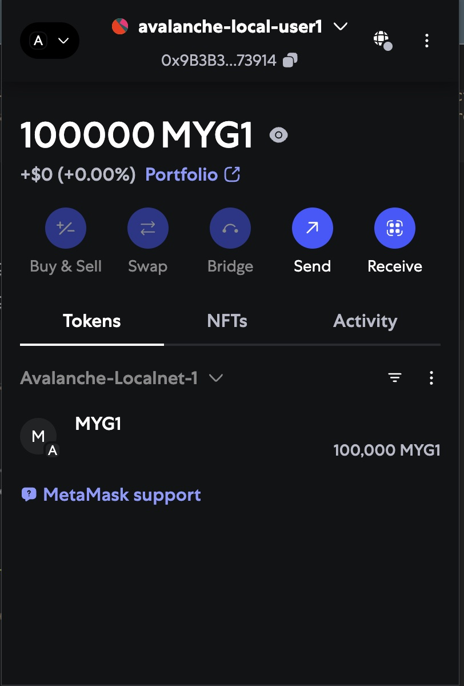
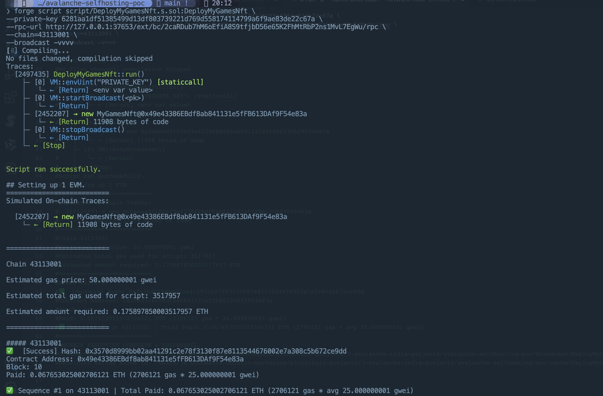
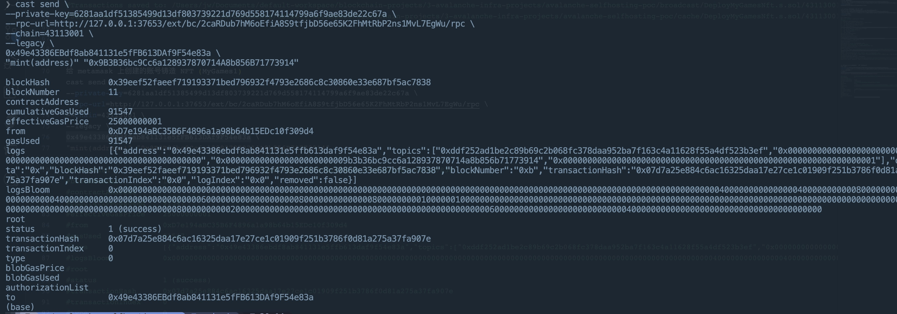
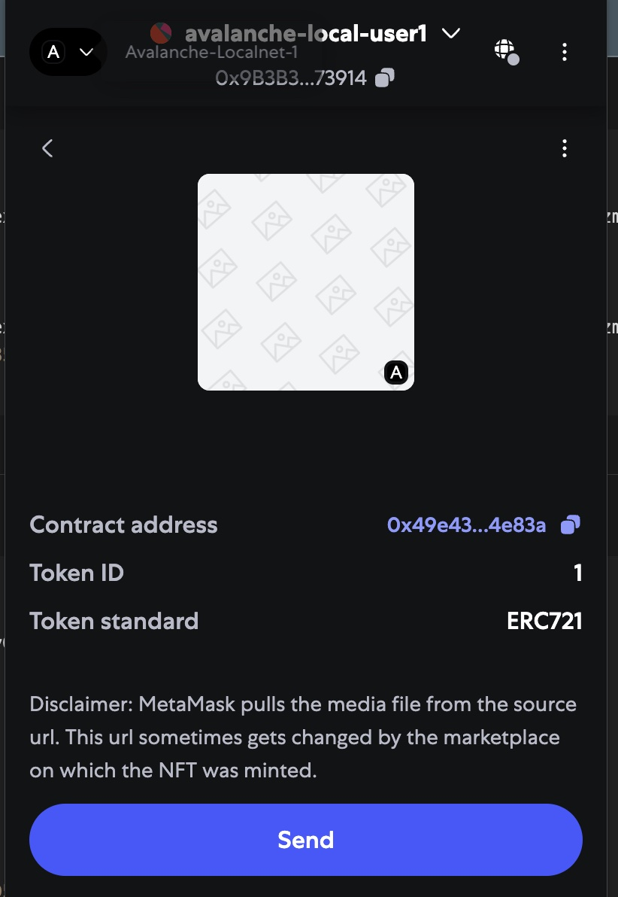
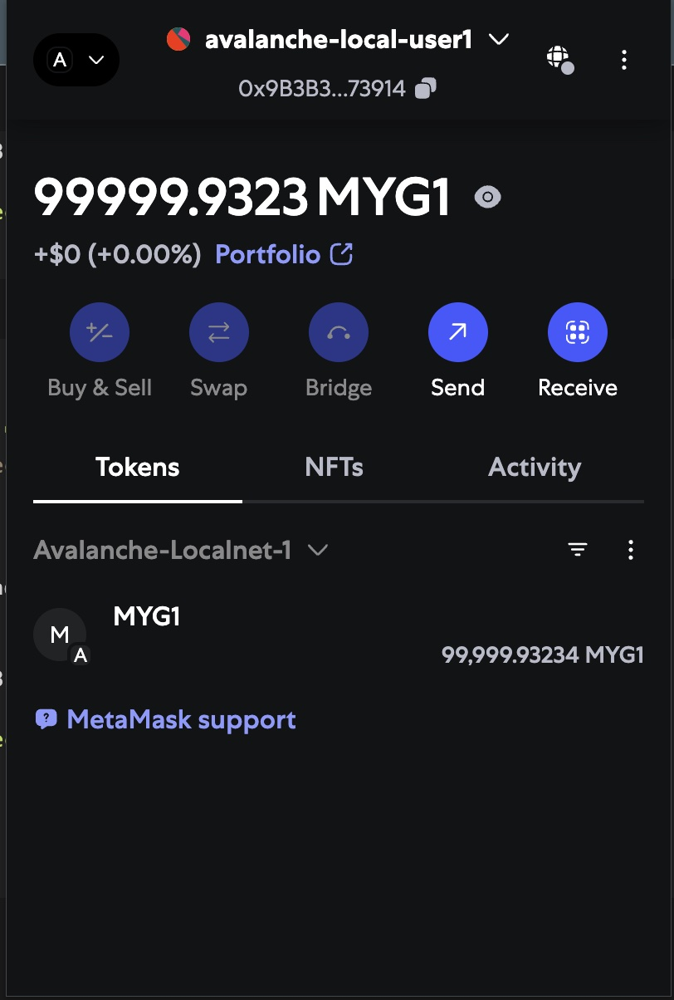

# Deployment Avalanche L1 Chain-1 and Transfer Token and Mint NFT Guide

## Details of Deployment & Verification

### Prerequisites

- First you can create the temporary EVM Account on Metamask for after Transfer Demo. such as the address: `0x9B3B36bc9Cc6a128937870714A8b856B71773914` and private key: `0829f52771f0d72cffafdf82865162adf034b7224ce2e1430507bf714f675f2f`

### 0. Deploy localnet Avalanche L1 chain

- Create Container (**Notice: We recommend using a clean environment for demonstrations so that you can clean up.**)

```bash
docker kill avalanche-localnet; docker rm avalanche-localnet 

# Run the container.
docker run -d \
--name avalanche-localnet \
--restart unless-stopped \
--network host \
--entrypoint bash registry.cn-shenzhen.aliyuncs.com/wl4g/debian:bookworm \
-c 'tail -f /dev/null'

# Enter the container.
docker exec -ti avalanche-localnet bash

# Install the infra libraries.
export BUILD_MIRROR_URL=http://mirrors.aliyun.com
rm -f /etc/apt/sources.list.d/debian.sources && \
echo "deb ${BUILD_MIRROR_URL}/debian bookworm main contrib non-free non-free-firmware" > /etc/apt/sources.list && \
echo "deb ${BUILD_MIRROR_URL}/debian-security bookworm-security main contrib non-free non-free-firmware" >> /etc/apt/sources.list && \
echo "deb ${BUILD_MIRROR_URL}/debian bookworm-updates main contrib non-free non-free-firmware" >> /etc/apt/sources.list && \
apt update && \
apt install -y --no-install-recommends pkg-config ca-certificates curl procps && \
apt clean && \
rm -rf /var/lib/apt/lists/*

echo "alias ll='ls -al'" >> ~/.bashrc
echo "alias cls=clear" >> ~/.bashrc
. ~/.bashrc
```

- Initial Chain (**Notice: If avalanche-cli downloads dependencies for a timeout, we can manually download the binraries and copy and install it.**)

```bash
# Approach 1:
curl -sSfL https://raw.githubusercontent.com/ava-labs/avalanche-cli/main/scripts/install.sh | sh -s
# If there are network slow you can be manual download avalanche-cli see:
# https://github.com/ava-labs/avalanche-cli/releases/latest

# Approach 2:
# Manual install with compile from source.
#git clone https://github.com/ava-labs/avalanche-cli
#cd avalanche-cli
#export GOOS=linux && export GOARCH=amd64 && ./scripts/build.sh

# Approach 3:
#curl -vL -o /bin/avalanche-cli 'https://github.com/ava-labs/avalanche-cli/releases/download/v1.8.10/avalanche-cli_1.8.10_linux_amd64.tar.gz'

# Approach 4:
#curl -vL -o /bin/avalanche-cli 'https://pkg.xxxx.com/public/tools/blockchain/avalanche/avalanche-cli-linux-amd64-v1.8.10.gz'

avalanche-cli blockchain create mygames1 --evm --latest --evm-chain-id 43113001 --evm-token MYG1 --evm-defaults
#✔ Proof Of Authority
#✔ Get address from an existing stored key (created from avalanche key create or avalanche key import)
#✔ ewoq
#✓ Validator Manager Contract owner address 0x8db97C7cEcE249c2b98bDC0226Cc4C2A57BF52FC
#prefunding address 0xD7e194aBC35B6F4896a1a98b64b15EDc10f309d4 with balance 1000000000000000000000000
#Installing subnet-evm-v0.7.3...
#subnet-evm-v0.7.3 installation successful
#File /root/.avalanche-cli/subnets/mygames1/chain.json successfully written
#✓ Successfully created blockchain configuration
#Run 'avalanche blockchain describe' to view all created addresses and what their roles are

# View the deployed L1 chains information.
avalanche-cli blockchain describe mygames1
```

- Deploy Chain: Manual download install binaraies

```bash
# Manual install avalanchego
mkdir -p ~/.avalanche-cli/bin/avalanchego/avalanchego-v1.13.0/
curl -vL -o ~/.avalanche-cli/bin/avalanchego/avalanchego-v1.13.0/avalanchego \
'https://pkg.xxxx.com/public/tools/blockchain/avalanche/avalanchego-linux-amd64-v1.13.0.tar.gz'
# Or use: https://github.com/ava-labs/avalanchego/releases/download/v1.13.0/avalanchego-linux-amd64-v1.13.0.tar.gz

# Manual install subnet-evm
mkdir -p ~/.avalanche-cli/bin/subnet-evm/subnet-evm-v0.7.3/
curl -vL -o ~/.avalanche-cli/bin/subnet-evm/subnet-evm-v0.7.3/avalanchego \
'https://pkg.xxxx.com/public/tools/blockchain/avalanche/subnet-evm_0.7.3_linux_amd64.tar.gz'
# Or use: https://github.com/ava-labs/subnet-evm/releases/download/v0.7.3/evm_0.7.3_linux_amd64.tar.gz
```

- Deploy Chain: Execution and Start up

```bash
avalanche-cli blockchain deploy mygames1 --local
```

- Operation Chain

```bash
tail -f ~/.avalanche-cli/logs/avalanche.log
tail -f ~/.avalanche-cli/logs/signature-aggregator.log 
tail -f ~/.avalanche-cli/runs/LocalNetwork/local-relayer/icm-relayer.log
tail -f ~/.avalanche-cli/runs/network_20250511_061155/NodeID-7Xhw2mDxuDS44j42TCB6U5579esbSt3Lg/logs/main.log
tail -f ~/.avalanche-cli/runs/awm-relayer.log
```

- 

### 1. Deploy localnet describe MyGames1

```bash
avalanche-cli blockchain describe mygames1
#+---------------------------------------------------------------------------------------------------------------------------------+
#|                                                             MYGAMES1                                                            |
#+---------------+-----------------------------------------------------------------------------------------------------------------+
#| Name          | mygames1                                                                                                        |
#+---------------+-----------------------------------------------------------------------------------------------------------------+
#| VM ID         | qDNbeu87sHXfCs4PaQSN2dGdkb843nxvxg2HBj4mkfZZQE4tc                                                               |
#+---------------+-----------------------------------------------------------------------------------------------------------------+
#| VM Version    | v0.7.3                                                                                                          |
#+---------------+-----------------------------------------------------------------------------------------------------------------+
#| Validation    | Proof Of Authority                                                                                              |
#+---------------+--------------------------+--------------------------------------------------------------------------------------+
#| Local Network | ChainID                  | 43113001                                                                             |
#|               +--------------------------+--------------------------------------------------------------------------------------+
#|               | SubnetID                 | 2W9boARgCWL25z6pMFNtkCfNA5v28VGg9PmBgUJfuKndEdhrvw                                   |
#|               +--------------------------+--------------------------------------------------------------------------------------+
#|               | Owners (Threhold=1)      | P-custom18jma8ppw3nhx5r4ap8clazz0dps7rv5u9xde7p                                      |
#|               +--------------------------+--------------------------------------------------------------------------------------+
#|               | BlockchainID (CB58)      | 2caRDub7hM6oEfiA8S9tfjbD56e65K2FhMtRbP2ns1MvL7EgWu                                   |
#|               +--------------------------+--------------------------------------------------------------------------------------+
#|               | BlockchainID (HEX)       | 0xd479e3d0a2cbd6ddbe09ac0ca4c720f6031828782b3b8b20670b9a2fb320254f                   |
#|               +--------------------------+--------------------------------------------------------------------------------------+
#|               | RPC Endpoint             | http://127.0.0.1:37653/ext/bc/2caRDub7hM6oEfiA8S9tfjbD56e65K2FhMtRbP2ns1MvL7EgWu/rpc |
#+---------------+--------------------------+--------------------------------------------------------------------------------------+
#
#+------------------------------------------------------------------------------------+
#|                                         ICM                                        |
#+---------------+-----------------------+--------------------------------------------+
#| Local Network | ICM Messenger Address | 0x253b2784c75e510dD0fF1da844684a1aC0aa5fcf |
#|               +-----------------------+--------------------------------------------+
#|               | ICM Registry Address  | 0xb6DC240Bb2B5E1a7c236110799B558599a5cF724 |
#+---------------+-----------------------+--------------------------------------------+
#
#+---------------------------+
#|           TOKEN           |
#+--------------+------------+
#| Token Name   | MYG1 Token |
#+--------------+------------+
#| Token Symbol | MYG1       |
#+--------------+------------+
#
#+----------------------------------------------------------------------------------------------------------------------------------------+
#|                                                        INITIAL TOKEN ALLOCATION                                                        |
#+-------------------------+------------------------------------------------------------------+---------------+---------------------------+
#| DESCRIPTION             | ADDRESS AND PRIVATE KEY                                          | AMOUNT (MYG1) | AMOUNT (WEI)              |
#+-------------------------+------------------------------------------------------------------+---------------+---------------------------+
#| Main funded account     | 0xD7e194aBC35B6F4896a1a98b64b15EDc10f309d4                       | 1000000       | 1000000000000000000000000 |
#| subnet_mygames1_airdrop | 6281aa1df51385499d13df803739221d769d558174114799a6f9ae83de22c67a |               |                           |
#+-------------------------+------------------------------------------------------------------+---------------+---------------------------+
#| Used by ICM             | 0x6ba6E8926Df4fC272a3267d533e215b272a70Bf5                       | 600           | 600000000000000000000     |
#| cli-teleporter-deployer | b7f093f4831da456ebb506fba7da77502edf4cd0aa400bd1622840439e4b52be |               |                           |
#+-------------------------+------------------------------------------------------------------+---------------+---------------------------+
#| Main funded account     | 0x8db97C7cEcE249c2b98bDC0226Cc4C2A57BF52FC                       | 10            | 10000000000000000000      |
#| ewoq                    | 56289e99c94b6912bfc12adc093c9b51124f0dc54ac7a766b2bc5ccf558d8027 |               |                           |
#+-------------------------+------------------------------------------------------------------+---------------+---------------------------+
#
#+----------------------------------------------------------------------------------------------------------------------------------+
#|                                                          SMART CONTRACTS                                                         |
#+----------------------------------------+--------------------------------------------+--------------------------------------------+
#| DESCRIPTION                            | ADDRESS                                    | DEPLOYER                                   |
#+----------------------------------------+--------------------------------------------+--------------------------------------------+
#| Transparent Proxy                      | 0x0Feedc0de0000000000000000000000000000000 |                                            |
#+----------------------------------------+--------------------------------------------+--------------------------------------------+
#| Validator Messages Lib                 | 0x9C00629cE712B0255b17A4a657171Acd15720B8C |                                            |
#+----------------------------------------+--------------------------------------------+--------------------------------------------+
#| Proxy Admin                            | 0xC0fFEE1234567890aBCdeF1234567890abcDef34 | 0x8db97C7cEcE249c2b98bDC0226Cc4C2A57BF52FC |
#+----------------------------------------+--------------------------------------------+--------------------------------------------+
#| ACP99 Compatible PoA Validator Manager | 0x0C0DEbA5E0000000000000000000000000000000 |                                            |
#+----------------------------------------+--------------------------------------------+--------------------------------------------+
#
#+----------------------------------------------------------------------+
#|                      INITIAL PRECOMPILE CONFIGS                      |
#+------------+-----------------+-------------------+-------------------+
#| PRECOMPILE | ADMIN ADDRESSES | MANAGER ADDRESSES | ENABLED ADDRESSES |
#+------------+-----------------+-------------------+-------------------+
#| Warp       | n/a             | n/a               | n/a               |
#+------------+-----------------+-------------------+-------------------+
#
#+--------------------------------------------------------------------------------------------------+
#|                                         MYGAMES1 RPC URLS                                        |
#+-----------+--------------------------------------------------------------------------------------+
#| Localhost | http://127.0.0.1:37653/ext/bc/2caRDub7hM6oEfiA8S9tfjbD56e65K2FhMtRbP2ns1MvL7EgWu/rpc |
#+-----------+--------------------------------------------------------------------------------------+
#
#+------------------------------------------------------------------+
#|                           PRIMARY NODES                          |
#+------------------------------------------+-----------------------+
#| NODE ID                                  | LOCALHOST ENDPOINT    |
#+------------------------------------------+-----------------------+
#| NodeID-7Xhw2mDxuDS44j42TCB6U5579esbSt3Lg | http://127.0.0.1:9650 |
#+------------------------------------------+-----------------------+
#| NodeID-MFrZFVCXPv5iCn6M9K6XduxGTYp891xXZ | http://127.0.0.1:9652 |
#+------------------------------------------+-----------------------+
#+------------------------------------------------------------------------------+
#|                                   L1 NODES                                   |
#+------------------------------------------+------------------------+----------+
#| NODE ID                                  | LOCALHOST ENDPOINT     | L1       |
#+------------------------------------------+------------------------+----------+
#| NodeID-HJh6GFYPPvLbcrTEGLtnk7KnJW3m5rk3A | http://127.0.0.1:37653 | mygames1 |
#+------------------------------------------+------------------------+----------+
#
#+--------------------------------------------------------------------------------------------------------+
#|                                            WALLET CONNECTION                                           |
#+-----------------+--------------------------------------------------------------------------------------+
#| Network RPC URL | http://127.0.0.1:37653/ext/bc/2caRDub7hM6oEfiA8S9tfjbD56e65K2FhMtRbP2ns1MvL7EgWu/rpc |
#+-----------------+--------------------------------------------------------------------------------------+
#| Network Name    | mygames1                                                                             |
#+-----------------+--------------------------------------------------------------------------------------+
#| Chain ID        | 43113001                                                                             |
#+-----------------+--------------------------------------------------------------------------------------+
#| Token Symbol    | MYG1                                                                                 |
#+-----------------+--------------------------------------------------------------------------------------+
#| Token Name      | MYG1 Token                                                                           |
#+-----------------+--------------------------------------------------------------------------------------+
```

- 

### 2. Deploy localnet chains listing

```bash
avalanche-cli blockchain list
#+----------+----------+----------+---------------------------------------------------+------------+------------+-----------+
#|  SUBNET  |  CHAIN   | CHAINID  |                       VMID                        |    TYPE    | VM VERSION | FROM REPO |
#+----------+----------+----------+---------------------------------------------------+------------+------------+-----------+
#| mygames1 | mygames1 | 43113001 | qDNbeu87sHXfCs4PaQSN2dGdkb843nxvxg2HBj4mkfZZQE4tc | Subnet-EVM | v0.7.3     | false     |
#+----------+----------+----------+---------------------------------------------------+------------+------------+-----------+
```

- 

### 3. Add localnet to Metamask

- 

### 4. Send native Token to Matamask account from Prefunding account

```bash
cast send \
--from 0xD7e194aBC35B6F4896a1a98b64b15EDc10f309d4 \
--value 100000ether \
--private-key 6281aa1df51385499d13df803739221d769d558174114799a6f9ae83de22c67a \
--rpc-url http://127.0.0.1:37653/ext/bc/2caRDub7hM6oEfiA8S9tfjbD56e65K2FhMtRbP2ns1MvL7EgWu/rpc \
--chain=43113001 \
0x9B3B36bc9Cc6a128937870714A8b856B71773914
```

- 

### 5. View Metamask Account custom native Token

- 

### 6. Deploy NFT contract with Prefunding account

```bash
forge script script/DeployMyGamesNft.s.sol:DeployMyGamesNft \
--private-key 6281aa1df51385499d13df803739221d769d558174114799a6f9ae83de22c67a \
--rpc-url http://127.0.0.1:37653/ext/bc/2caRDub7hM6oEfiA8S9tfjbD56e65K2FhMtRbP2ns1MvL7EgWu/rpc \
--chain=43113001 \
--broadcast -vvvv

#[⠊] Compiling...
#No files changed, compilation skipped
#Traces:
#  [2497435] DeployMyGamesNft::run()
#    ├─ [0] VM::envUint("PRIVATE_KEY") [staticcall]
#    │   └─ ← [Return] <env var value>
#    ├─ [0] VM::startBroadcast(<pk>)
#    │   └─ ← [Return] 
#    ├─ [2452207] → new MyGamesNft@0x49e43386EBdf8ab841131e5fFB613DAf9F54e83a
#    │   └─ ← [Return] 11908 bytes of code
#    ├─ [0] VM::stopBroadcast()
#    │   └─ ← [Return] 
#    └─ ← [Stop] 
#Script ran successfully.
### Setting up 1 EVM.
#==========================
#Simulated On-chain Traces:
#  [2452207] → new MyGamesNft@0x49e43386EBdf8ab841131e5fFB613DAf9F54e83a
#    └─ ← [Return] 11908 bytes of code
#==========================
#Chain 43113001
#Estimated gas price: 50.000000001 gwei
#Estimated total gas used for script: 3517957
#Estimated amount required: 0.175897850003517957 ETH
#==========================
###### 43113001
#✅  [Success] Hash: 0x3570d8999bb02aa41291c2e78f3130f87e8113544676002e7a308c5b672ce9dd
#Contract Address: 0x49e43386EBdf8ab841131e5fFB613DAf9F54e83a
#Block: 10
#Paid: 0.067653025002706121 ETH (2706121 gas * 25.000000001 gwei)
#✅ Sequence #1 on 43113001 | Total Paid: 0.067653025002706121 ETH (2706121 gas * avg 25.000000001 gwei)
#==========================
#ONCHAIN EXECUTION COMPLETE & SUCCESSFUL.
#Transactions saved to: .../avalanche-selfhosting-poc/broadcast/DeployMyGamesNft.s.sol/43113001/run-latest.json
#Sensitive values saved to: .../avalanche-selfhosting-poc/cache/DeployMyGamesNft.s.sol/43113001/run-latest.json
```

- 

### 7. Import NFT contract to Metamask

- .jpg)

### 8. Mint NFT on `MyGames1` L1 chain

```bash
cast send \
--private-key=6281aa1df51385499d13df803739221d769d558174114799a6f9ae83de22c67a \
--rpc-url=http://127.0.0.1:37653/ext/bc/2caRDub7hM6oEfiA8S9tfjbD56e65K2FhMtRbP2ns1MvL7EgWu/rpc \
--chain=43113001 \
--legacy \
0x49e43386EBdf8ab841131e5fFB613DAf9F54e83a \
"mint(address)" "0x9B3B36bc9Cc6a128937870714A8b856B71773914"

#blockHash            0x39eef52faeef719193371bed796932f4793e2686c8c30860e33e687bf5ac7838
#blockNumber          11
#contractAddress      
#cumulativeGasUsed    91547
#effectiveGasPrice    25000000001
#from                 0xD7e194aBC35B6F4896a1a98b64b15EDc10f309d4
#gasUsed              91547
#logs                 [{"address":"0x49e43386ebdf8ab841131e5ffb613daf9f54e83a","topics":["0xddf252ad1be2c89b69c2b068fc378daa952ba7f163c4a11628f55a4df523b3ef","0x0000000000000000000000000000000000000000000000000000000000000000","0x0000000000000000000000009b3b36bc9cc6a128937870714a8b856b71773914","0x0000000000000000000000000000000000000000000000000000000000000001"],"data":"0x","blockHash":"0x39eef52faeef719193371bed796932f4793e2686c8c30860e33e687bf5ac7838","blockNumber":"0xb","transactionHash":"0x07d7a25e884c6ac16325daa17e27ce1c01909f251b3786f0d81a275a37fa907e","transactionIndex":"0x0","logIndex":"0x0","removed":false}]
#logsBloom            0x00000000000000000000000000000000000000000000000000000000000000000000000000000000000000000000000000000000000000000000000000040000000000000004000000000008000000000000000000040000000000000000000000000000060000000000000000000800000000000000800000000010000001000000000000000000000000000000000000000000000000000000000000000000000000000000000000000000000000000000000000000000000000000000800000000002000000000000000000000000000000000000000000000000000060000000000000000000000000004000000000000000000000000000000000000000
#root                 
#status               1 (success)
#transactionHash      0x07d7a25e884c6ac16325daa17e27ce1c01909f251b3786f0d81a275a37fa907e
#transactionIndex     0
#type                 0
#blobGasPrice         
#blobGasUsed          
#authorizationList    
#to                   0x49e43386EBdf8ab841131e5fFB613DAf9F54e83a
```

- 

### 9. View NFT with Metamask

- 

### 10. View custom native Token (after deploy contract)

- 

## Other Opertions

### Obtaining latest Block Number

```bash
cast block-number --rpc-url http://127.0.0.1:37653/ext/bc/2caRDub7hM6oEfiA8S9tfjbD56e65K2FhMtRbP2ns1MvL7EgWu/rpc
#11
```

### Obtaining latest Block transactions

```bash
cast block latest --rpc-url http://127.0.0.1:37653/ext/bc/2caRDub7hM6oEfiA8S9tfjbD56e65K2FhMtRbP2ns1MvL7EgWu/rpc --json | jq
#{
#  "hash": "0x39eef52faeef719193371bed796932f4793e2686c8c30860e33e687bf5ac7838",
#  "parentHash": "0xa6057a9b090a25370e4e2de087ac4847d1adb5c63f9067ea07bf5181fa390685",
#  "sha3Uncles": "0x1dcc4de8dec75d7aab85b567b6ccd41ad312451b948a7413f0a142fd40d49347",
#  "miner": "0x0100000000000000000000000000000000000000",
#  "stateRoot": "0x6c69b3c90c375932275be8bfa75d470fdd10349097030ba05041afb2469ddc2c",
#  "transactionsRoot": "0x3a460ad8c01074d90472cab5e4e8d1ffbd0f1e6a26ccdaa30d2e811d0ed013fd",
#  "receiptsRoot": "0x896c49119663d4ce322c7dee82f86ff339007b05b5723ef2e55ec51f46169c01",
#  "logsBloom": "0x00000000000000000000000000000000000000000000000000000000000000000000000000000000000000000000000000000000000000000000000000040000000000000004000000000008000000000000000000040000000000000000000000000000060000000000000000000800000000000000800000000010000001000000000000000000000000000000000000000000000000000000000000000000000000000000000000000000000000000000000000000000000000000000800000000002000000000000000000000000000000000000000000000000000060000000000000000000000000004000000000000000000000000000000000000000",
#  "difficulty": "0x1",
#  "number": "0xb",
#  "gasLimit": "0xb71b00",
#  "gasUsed": "0x1659b",
#  "timestamp": "0x682094a1",
#  "extraData": "0x0000000000000000000000000000000000000000000000000000000000000000000000000000000000000000000000000000000000000000000000000000000000000000000000000000000000000000000000000000",
#  "mixHash": "0x0000000000000000000000000000000000000000000000000000000000000000",
#  "nonce": "0x0000000000000000",
#  "baseFeePerGas": "0x5d21dba00",
#  "blobGasUsed": "0x0",
#  "excessBlobGas": "0x0",
#  "parentBeaconBlockRoot": "0x0000000000000000000000000000000000000000000000000000000000000000",
#  "totalDifficulty": "0xb",
#  "size": "0x310",
#  "uncles": [],
#  "transactions": [
#    "0x07d7a25e884c6ac16325daa17e27ce1c01909f251b3786f0d81a275a37fa907e"
#  ],
#  "blockGasCost": "0x0"
#}
```
