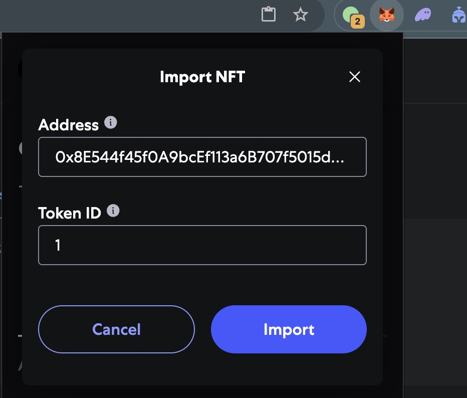
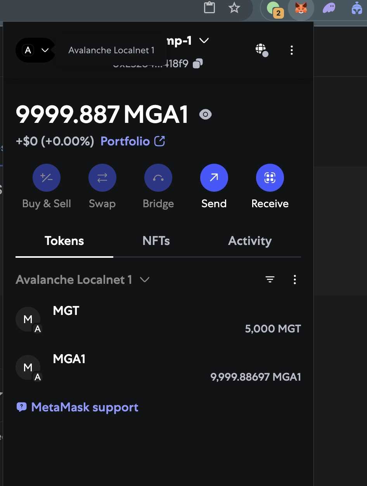

# Deployment of Avalanche L1 Multi Chains + Mint NFT + ERC20 Token Cross-Chain Bridge Transfer

## 1. Deployment L1 Chain

### 1.1. (**Optional**) Build Avalanche L1 Chain Docker Image

- **Recommends:** You can build the Avalanche local network image yourself, but if you want to quickly start the Avalanche native network, please skip this step and go directly to step [1.2](#12-deploy-localnet-avalanche-l1-chains) to start the container using the built image.

```bash
./build.sh
```

### 1.2. Deploy localnet Avalanche L1 chains

- Create Container (**Notice: We recommend using a clean environment for demonstrations so that you can clean up.**)

```bash
docker kill avalanche-localnet; docker rm avalanche-localnet 

# Run the container.
docker run -d \
--platform linux/amd64 \
--name avalanche-localnet \
--restart unless-stopped \
--network host \
--entrypoint bash registry.cn-shenzhen.aliyuncs.com/wl4g/avalanche-local-base:v1.13.0 \
-c 'tail -f /dev/null'

# Enter the container.
docker exec -ti avalanche-localnet bash
```

- Initial Chain (**Notice: If avalanche-cli downloads dependencies for a timeout, we can manually download the binraries and copy and install it.**), see: [https://build.avax.network/docs/tooling/create-avalanche-l1](https://build.avax.network/docs/tooling/create-avalanche-l1)

- **Notice: Custom the define chain IDs must without registered only. e.g. You can go to [chainlist.org](https://chainlist.org/?testnets=true&search=fuji) to check it**

```bash
avalanche-cli blockchain create mygames1 --evm --latest --evm-chain-id 43113001 --evm-token MGA1 --evm-defaults --proof-of-authority
avalanche-cli blockchain create mygames2 --evm --latest --evm-chain-id 43113002 --evm-token MGA2 --evm-defaults --proof-of-authority
#✔ Proof Of Authority
#✔ Get address from an existing stored key (created from avalanche key create or avalanche key import)
#✔ ewoq
#✓ Validator Manager Contract owner address 0x8db97C7cEcE249c2b98bDC0226Cc4C2A57BF52FC
#prefunding address 0xD7e194aBC35B6F4896a1a98b64b15EDc10f309d4 with balance 1000000000000000000000000
#Installing subnet-evm-v0.7.3...
#subnet-evm-v0.7.3 installation successful
#File /root/.avalanche-cli/subnets/mygames1/chain.json successfully written
#✓ Successfully created blockchain configuration
#Run 'avalanche blockchain describe' to view all created addresses and what their roles are
```

- Deploy Chain: Execution and Start up

```bash
avalanche-cli blockchain deploy mygames1 --local --teleporter-version v1.0.0 --relayer-version icm-relayer-v1.6.3 --icm-version v1.0.0
avalanche-cli blockchain deploy mygames2 --local --teleporter-version v1.0.0 --relayer-version icm-relayer-v1.6.3 --icm-version v1.0.0
```

- 

- **(Optional + Recommends)** Start Fake Github API server for Skip `avalanche-cli` Check Update too slow.

```bash
cd ~ && nohup python3 fake-github-api-server.py >/tmp/fake-github-api-server.log 2>&1 &

echo "127.0.0.1 api.github.com" >> /etc/hosts

curl -v https://api.github.com/repos/ava-labs/avalanchego/releases/latest
```

### 1.3. Deploy localnet describe Chains of `MyGames1` and `MyGames2`

```bash
avalanche-cli blockchain describe mygames1
avalanche-cli blockchain describe mygames2
```

- 

### 1.4. Check localnet Status & Chains listing

```bash
avalanche-cli network status
#Network is Up:
#  Number of Nodes: 4
#  Number of Blockchains: 2
#  Network Healthy: true
#  Blockchains Healthy: true
#
#+-------------------------------------------------------------------------------------------------+
#|                                        MYGAMES1 RPC URLS                                        |
#+-----------+-------------------------------------------------------------------------------------+
#| Localhost | http://127.0.0.1:46255/ext/bc/1MVcrRFW8QujSdebpnMsRYWLMRM1FrKi2V7Je9ivu7zwHboos/rpc |
#+-----------+-------------------------------------------------------------------------------------+
#
#+--------------------------------------------------------------------------------------------------+
#|                                         MYGAMES2 RPC URLS                                        |
#+-----------+--------------------------------------------------------------------------------------+
#| Localhost | http://127.0.0.1:35517/ext/bc/2cE56bMf7SS5vTvdTpHAPfvxfTGryFsP7DNJNe7CwMXTRCPViZ/rpc |
#+-----------+--------------------------------------------------------------------------------------+
#
#+------------------------------------------------------------------+
#|                           PRIMARY NODES                          |
#+------------------------------------------+-----------------------+
#| NODE ID                                  | LOCALHOST ENDPOINT    |
#+------------------------------------------+-----------------------+
#| NodeID-7Xhw2mDxuDS44j42TCB6U5579esbSt3Lg | http://127.0.0.1:9650 |
#+------------------------------------------+-----------------------+
#| NodeID-MFrZFVCXPv5iCn6M9K6XduxGTYp891xXZ | http://127.0.0.1:9652 |
#+------------------------------------------+-----------------------+
#+------------------------------------------------------------------------------+
#|                                   L1 NODES                                   |
#+------------------------------------------+------------------------+----------+
#| NODE ID                                  | LOCALHOST ENDPOINT     | L1       |
#+------------------------------------------+------------------------+----------+
#| NodeID-JgBbGdWHbMLNYGDJxwRmfGYnYDLjwxUuY | http://127.0.0.1:46255 | mygames1 |
#+------------------------------------------+------------------------+----------+
#| NodeID-CfY3LmPSy1YbFuv3UZJVeTURcxMh6zfTZ | http://127.0.0.1:35517 | mygames2 |
#+------------------------------------------+------------------------+----------+

avalanche-cli blockchain list
#+----------+----------+----------+---------------------------------------------------+------------+------------+-----------+
#|  SUBNET  |  CHAIN   | CHAINID  |                       VMID                        |    TYPE    | VM VERSION | FROM REPO |
#+----------+----------+----------+---------------------------------------------------+------------+------------#+-----------+
#| mygames1 | mygames1 | 43113001 | qDNbeu87sHXfCs4PaQSN2dGdkb843nxvxg2HBj4mkfZZQE4tc | Subnet-EVM | v0.7.3     | false     |
#+----------+----------+----------+---------------------------------------------------+------------+------------#+-----------+
#| mygames2 | mygames2 | 43113002 | qDNbeu87sHaHvNBDN8K2epBvD7WAziU1hkMFCN8zFZoicnjjy | Subnet-EVM | v0.7.3     | false     |
#+----------+----------+----------+---------------------------------------------------+------------+------------+-----------+
```

- 

## 2. Verification Native Token Transactions

### 2.1. Add localnet to Metamask

- 

### 2.2. Send Native Token to Own EOA accounts from Prefunding accounts

- 2.2.1 Setup localnet chains info and EOA Accounts to environment for after transactions Demo.

```bash
export CHAIN_ID_1=43113001
export CHAIN_ID_2=43113002
export CHAIN_RPC_URL_1="http://127.0.0.1:46255/ext/bc/1MVcrRFW8QujSdebpnMsRYWLMRM1FrKi2V7Je9ivu7zwHboos/rpc"
export CHAIN_RPC_URL_2="http://127.0.0.1:35517/ext/bc/2cE56bMf7SS5vTvdTpHAPfvxfTGryFsP7DNJNe7CwMXTRCPViZ/rpc"

# Own Test EOA accounts created on Metamask
export TEST_ACCOUNT_KEY_1="0x7bf00a22957531afd8cd99caf21c2090967a42cf2d26a03dfb55ec2dcc2ee118"
export TEST_ACCOUNT_ADDR_1="0xE3264679734A5d57E3ffb29905b1db37F9E418f9"
export TEST_ACCOUNT_KEY_2="0x35d52577ec6854a324e20dd7de5ca1e4b7c34f9b073b518b23c54857e8ee4010"
export TEST_ACCOUNT_ADDR_2="0xf7Ba3B240C66A62deA538C8B5FbE7b081Ddf2b5F"

# Pre-funding Initial EOA accounts created by Avalanche
export INIT_ACCOUNT_KEY_1="0xc422374747ed86d3f3e3d977967128965ba51a47b5ec198d05dff328120dc1d4"
export INIT_ACCOUNT_ADDR_1="0x104A729Ec7B7B1Ecc9933a14Dfad92BAB1218c64"
export INIT_ACCOUNT_KEY_2="0x1e324869565ffe00af3f64d0cb9f7f18903699b3c62f3dc4556cc41e8852cfeb"
export INIT_ACCOUNT_ADDR_2="0x97D49A1589D44A3aCCf327Fb6d42a5E3345FB698"
```

- 2.2.2 Sent the `10000 MGA1` Native Token to Own EOA Account 1 on `MyGames1` Chain.

```bash
cast send \
--rpc-url ${CHAIN_RPC_URL_1} \
--private-key ${INIT_ACCOUNT_KEY_1} \
--from ${INIT_ACCOUNT_ADDR_1} \
--value 10000ether \
--chain=${CHAIN_ID_1} \
${TEST_ACCOUNT_ADDR_1}

# Obtaining balance of Own EOA account 1 (symbol: MGA1)
cast balance \
--rpc-url ${CHAIN_RPC_URL_1} \
--ether \
${TEST_ACCOUNT_ADDR_1}
#9999.887848424995513937
```

- 

- 2.2.3 Sent the `20000 MGA2` Native Token to Own EOA Account 2 on `MyGames2` Chain.

```bash
cast send \
--rpc-url ${CHAIN_RPC_URL_2} \
--private-key ${INIT_ACCOUNT_KEY_2} \
--from ${INIT_ACCOUNT_ADDR_2} \
--value 20000ether \
--chain=${CHAIN_ID_2} \
${TEST_ACCOUNT_ADDR_2}

# Obtaining balance of Own EOA account 2 on Chain 2 (symbol: MGA2)
cast balance \
--rpc-url ${CHAIN_RPC_URL_2} \
--ether \
${TEST_ACCOUNT_ADDR_2}
#19999.828208199997128328
```

- 

## 3. Deploy NFT & Verification

### 3.1. Deploy NFT Token contracts with Prefunding Accounts

- Deploy NFT contract on Chain 1

```bash
export PRIVATE_KEY="${INIT_ACCOUNT_KEY_1}"
forge script script/DeployMyGamesNft.s.sol:DeployMyGamesNft \
--rpc-url ${CHAIN_RPC_URL_1} \
--private-key ${INIT_ACCOUNT_KEY_1} \
--chain=43113001 \
--broadcast -vvvv

#[⠊] Compiling...
#No files changed, compilation skipped
#Traces:
#  [2497435] DeployMyGamesNft::run()
#    ├─ [0] VM::envUint("PRIVATE_KEY") [staticcall]
#    │   └─ ← [Return] <env var value>
#    ├─ [0] VM::startBroadcast(<pk>)
#    │   └─ ← [Return] 
#    ├─ [2452207] → new MyGamesNft@0x8E544f45f0A9bcEf113a6B707f5015d099a96ECe
#    │   └─ ← [Return] 11908 bytes of code
#    ├─ [0] VM::stopBroadcast()
#    │   └─ ← [Return] 
#    └─ ← [Stop] 
#Script ran successfully.
### Setting up 1 EVM.
#==========================
#Simulated On-chain Traces:
#  [2452207] → new MyGamesNft@0x8E544f45f0A9bcEf113a6B707f5015d099a96ECe
#    └─ ← [Return] 11908 bytes of code
#==========================
#Chain 43113001
#Estimated gas price: 50.000000001 gwei
#Estimated total gas used for script: 3517957
#Estimated amount required: 0.175897850003517957 ETH
#==========================
###### 43113001
#✅  [Success] Hash: 0x3570d8999bb02aa41291c2e78f3130f87e8113544676002e7a308c5b672ce9dd
#Contract Address: 0x8E544f45f0A9bcEf113a6B707f5015d099a96ECe
#Block: 10
#Paid: 0.067653025002706121 ETH (2706121 gas * 25.000000001 gwei)
#✅ Sequence #1 on 43113001 | Total Paid: 0.067653025002706121 ETH (2706121 gas * avg 25.000000001 gwei)
#==========================
#ONCHAIN EXECUTION COMPLETE & SUCCESSFUL.
#Transactions saved to: .../avalanche-selfhosting-poc/broadcast/DeployMyGamesNft.s.sol/43113001/run-latest.json
#Sensitive values saved to: .../avalanche-selfhosting-poc/cache/DeployMyGamesNft.s.sol/43113001/run-latest.json

export MYGAMES_NFT_ADDR_1="0x8E544f45f0A9bcEf113a6B707f5015d099a96ECe"
```

### 3.2. Mint NFT to Own EOA Accounts

- Mint NFT to Own EOA Account 1 on Chain 1

```bash
cast send \
--rpc-url=${CHAIN_RPC_URL_1} \
--private-key=${INIT_ACCOUNT_KEY_1} \
--chain=43113001 \
--legacy \
${MYGAMES_NFT_ADDR_1} \
"mint(address)" "${TEST_ACCOUNT_ADDR_1}"

#blockHash            0x39eef52faeef719193371bed796932f4793e2686c8c30860e33e687bf5ac7838
#blockNumber          11
#contractAddress      
#cumulativeGasUsed    91547
#effectiveGasPrice    25000000001
#from                 0xD7e194aBC35B6F4896a1a98b64b15EDc10f309d4
#gasUsed              91547
#logs                 [{"address":"0x8E544f45f0A9bcEf113a6B707f5015d099a96ECe","topics":["0xddf252ad1be2c89b69c2b068fc378daa952ba7f163c4a11628f55a4df523b3ef","0x0000000000000000000000000000000000000000000000000000000000000000","0x0000000000000000000000009b3b36bc9cc6a128937870714a8b856b71773914","0x0000000000000000000000000000000000000000000000000000000000000001"],"data":"0x","blockHash":"0x39eef52faeef719193371bed796932f4793e2686c8c30860e33e687bf5ac7838","blockNumber":"0xb","transactionHash":"0x07d7a25e884c6ac16325daa17e27ce1c01909f251b3786f0d81a275a37fa907e","transactionIndex":"0x0","logIndex":"0x0","removed":false}]
#logsBloom            0x00000000000000000000000000000000000000000000000000000000000000000000000000000000000000000000000000000000000000000000000000040000000000000004000000000008000000000000000000040000000000000000000000000000060000000000000000000800000000000000800000000010000001000000000000000000000000000000000000000000000000000000000000000000000000000000000000000000000000000000000000000000000000000000800000000002000000000000000000000000000000000000000000000000000060000000000000000000000000004000000000000000000000000000000000000000
#root                 
#status               1 (success)
#transactionHash      0x07d7a25e884c6ac16325daa17e27ce1c01909f251b3786f0d81a275a37fa907e
#transactionIndex     0
#type                 0
#blobGasPrice         
#blobGasUsed          
#authorizationList    
#to                   0x8E544f45f0A9bcEf113a6B707f5015d099a96ECe
```

### 3.3. Importing NFT contract to Metamask View

- Import NFT contract to Metamask (Chain 1)
- 

- View imported NFT overview contract on Metamask (Chain 1)
- 

- View imported NFT details contract on Metamask (Chain 1)
- 

## 4. Deploy ERC20 & Verification

### 4.1. Deploy ERC20 Token contract with Prefunding Accounts

- Deploy ERC20 Token contract on Chain 1

```bash
export PRIVATE_KEY="${INIT_ACCOUNT_KEY_1}"
forge script script/DeployMyGamesToken.s.sol:DeployMyGamesToken \
--rpc-url ${CHAIN_RPC_URL_1} \
--private-key ${PRIVATE_KEY} \
--broadcast -vvvv
#✅ ...
export MYGAMES_TOKEN_ADDR_1="0x26BB8135E9C1979da193ab324cb5ecBA4A97cff3"
```

- Deploy ERC20 Token contract on Chain 2

```bash
export PRIVATE_KEY="${INIT_ACCOUNT_KEY_2}"
forge script script/DeployMyGamesToken.s.sol:DeployMyGamesToken \
--rpc-url ${CHAIN_RPC_URL_2} \
--private-key ${PRIVATE_KEY} \
--broadcast -vvvv
#✅ ...
export MYGAMES_TOKEN_ADDR_2="0x6E11c8B47CC5a9C2af8365B88F28DdDF93674FF4"
```

### 4.2. Transfer ERC20 Token to Own Accounts from Prefunding Accounts

- Transfer ERC20 Token to Own Account 1 from Prefunding Account 1 on Chain 1

```bash
cast send \
--rpc-url=${CHAIN_RPC_URL_1} \
--chain=43113001 \
--private-key=${INIT_ACCOUNT_KEY_1} \
--legacy \
${MYGAMES_TOKEN_ADDR_1} \
"transfer(address,uint256)" "${TEST_ACCOUNT_ADDR_1}" 5000000000000000000000

# Obtaining the balance of the Own Account 1
cast call \
--rpc-url=${CHAIN_RPC_URL_1} \
${MYGAMES_TOKEN_ADDR_1} \
"balanceOf(address)(uint256)" \
"${TEST_ACCOUNT_ADDR_1}"
#5000000000000000000000
```

- Transfer ERC20 Token to Own Account 2 from Prefunding Account 2 on Chain 2

```bash
cast send \
--rpc-url=${CHAIN_RPC_URL_2} \
--chain=43113002 \
--private-key=${INIT_ACCOUNT_KEY_2} \
--legacy \
${MYGAMES_TOKEN_ADDR_2} \
"transfer(address,uint256)" "${TEST_ACCOUNT_ADDR_2}" 8000000000000000000000

# Obtaining the balance of the Own Account 1
cast call \
--rpc-url=${CHAIN_RPC_URL_2} \
${MYGAMES_TOKEN_ADDR_2} \
"balanceOf(address)(uint256)" \
"${TEST_ACCOUNT_ADDR_2}"
#8000000000000000000000
```

### 4.3. Importing ERC20 contract to Metamask View

- Import ERC20 contract to Metamask (Chain 1)
- 

- View immported ERC20 contract to Metamask (Chain 1)
- 

- View immported ERC20 contract to Metamask (Chain 2)
- 

## 5. Cross-chain ERC20 Tokens Transfer and Messaging & Verification

### 5.1. Deploy Bridge contracts with Prefunding accounts

- Deploy Bridge contract on Chain 1

```bash
export PRIVATE_KEY="${INIT_ACCOUNT_KEY_1}"
forge script script/crosschaintoken/DeploySimpleERC20Bridge.s.sol:DeploySimpleERC20Bridge \
--rpc-url ${CHAIN_RPC_URL_1} \
--private-key ${PRIVATE_KEY} \
--broadcast -vvvv
#✅ ...
export MYGAMES_SIMPLE_BRIDGE_ADDR_1="0x4eD12cd8394708a8f2bd011F7db73AC715719d86"
```

- Deploy Bridge contract on Chain 2

```bash
export PRIVATE_KEY="${INIT_ACCOUNT_KEY_2}"
forge script script/crosschaintoken/DeploySimpleERC20Bridge.s.sol:DeploySimpleERC20Bridge \
--rpc-url ${CHAIN_RPC_URL_2} \
--private-key ${PRIVATE_KEY} \
--broadcast -vvvv
#✅ ...
export MYGAMES_SIMPLE_BRIDGE_ADDR_2="0x4facC87BDe23b6E699768695A9DCD977eecad209"
```

### 5.2. Initializing preparing of Cross-Chain Tokens Transfer

- **Important:** We should first ensure the `SimpleERC20Bridge` contract address has sufficient ERC20 Token liquidity (cross-chain pool) balance in **Chain 2 (Destination Chain/`mygames2`)**. Otherwise, when performing cross-chain transactions later, it will fail because in the `receiveTeleporterMessage()` failed to cannot transfer funds to `{TEST_ACCOUNT_ADDR_1}`, i.e: Mint tokens for him. Finally, once the cross-chain transfer is successful, we will expected see that the ERC20 Token balance of address `{TEST_ACCOUNT_ADDR_1}` in **Chain 2 (Destination Chain/`mygames2`)** will increase by `amount`.

```bash
cast send \
--private-key=${INIT_ACCOUNT_KEY_2} \
--rpc-url=${CHAIN_RPC_URL_2} \
--chain=43113002 \
--legacy \
${MYGAMES_TOKEN_ADDR_2} \
"transfer(address,uint256)" "${MYGAMES_SIMPLE_BRIDGE_ADDR_2}" 90000000000000000000000

# Obtaining the ERC20 balance of SimpleERC20Bridge address on Chain 2
cast call \
--rpc-url=${CHAIN_RPC_URL_2} \
${MYGAMES_TOKEN_ADDR_2} \
"balanceOf(address)(uint256)" "${MYGAMES_SIMPLE_BRIDGE_ADDR_2}"
#90000000000000000000000 [9e22]
```

### 5.3. Preflighting Cross-Chain Tokens Balances

- **Tips:** Before the cross-chain transfer, we can first check the ERC20 Token balance on `{TEST_ACCOUNT_ADDR_1}` **chain 1(source chain/`mygames1`)**, because once the cross-chain transfer is successful, we will see the expected effect, that is, the `amount` of funds is **locked**.

```bash
cast call \
--rpc-url=${CHAIN_RPC_URL_1} \
${MYGAMES_TOKEN_ADDR_1} \
"balanceOf(address)(uint256)" "${TEST_ACCOUNT_ADDR_1}"
#5000000000000000000000 [5e21]
```

- **Tips:** Before the cross-chain transfer, we can first check the ERC20 Token balance of `{TEST_ACCOUNT_ADDR_1}` on **chain 2 (destination chain/`mygames2`)**, because once the cross-chain transfer is successful, we will see the expected effect, that is, the balance will **increase** by `amount`.

```bash
cast call \
--rpc-url=${CHAIN_RPC_URL_2} \
${MYGAMES_TOKEN_ADDR_2} \
"balanceOf(address)(uint256)" "${TEST_ACCOUNT_ADDR_1}"
#0
```

### 5.4. Cross-Chain Tokens Transfer (Power by ICM/Teleporter)

- Obtaining the BlockchainID 2 Hex for `Cast` sending later.

```bash
echo "export CHAIN_ID_2_HEX=$(avalanche-cli blockchain describe mygames2 | grep 'BlockchainID (HEX)' | awk -F '|' '{print $4}' | sed 's/ //g')"
#export CHAIN_ID_2_HEX=0xd3adf89911adb4fd1574248d5b9a4f80034de192c6f7e01036e47c28d1cff325
```

- Firstly we are need to `approve` the ERC20 Token Transfer for auto transferable by Source Bridge.

```bash
cast send \
--rpc-url=${CHAIN_RPC_URL_1} \
--private-key=${TEST_ACCOUNT_KEY_1} \
${MYGAMES_TOKEN_ADDR_1} \
"approve(address,uint256)(bool)" \
${MYGAMES_SIMPLE_BRIDGE_ADDR_1} \
200000000000000000000
```

- Sending chain-chain transaction messages to `MyGames2` from `MyGames1`.

```bash
cast send \
--rpc-url ${CHAIN_RPC_URL_1} \
--private-key ${TEST_ACCOUNT_KEY_1} \
${MYGAMES_SIMPLE_BRIDGE_ADDR_1} \
"sendERC20WithICM(bytes32,address,address,address,uint256,string)" \
"${CHAIN_ID_HEX_2}" "${MYGAMES_SIMPLE_BRIDGE_ADDR_2}" "${MYGAMES_TOKEN_ADDR_1}" "${MYGAMES_TOKEN_ADDR_2}" 200000000000000000000 "Hello this a interchain token transfer #101"
```

- Check the Cross-chain transfered messages

```bash
# View the last cross-chain token transfer amount.
cast call \
--rpc-url ${CHAIN_RPC_URL_2} \
"${MYGAMES_SIMPLE_BRIDGE_ADDR_2}" "lastSwapAmount()(uint256)"
#200000000000000000000

# View the last cross-chain token transfer message.
cast call \
--rpc-url ${CHAIN_RPC_URL_2} \
"${MYGAMES_SIMPLE_BRIDGE_ADDR_2}" "lastSwapRemark()(string)"
#"Hello this a interchain token transfer #101"
```

- Check the after cross-chain token transfered balances for `{TEST_ACCOUNT_ADDR_1}` on the `MyGames2` chain.

```bash
cast call \
--rpc-url=${CHAIN_RPC_URL_2} \
${MYGAMES_TOKEN_ADDR_2} \
"balanceOf(address)(uint256)" \
"${TEST_ACCOUNT_ADDR_1}"
#200000000000000000000
```

- We can see EOA `{TEST_ACCOUNT_ADDR_1}` on **Chain 1** balances reduced `200MGT` with Metamask.
- 

- We can see EOA `{TEST_ACCOUNT_ADDR_1}` on **Chain 2** balances increased `200MGT` with Metamask
- 

- BEFORE: We can see EOA `{TEST_ACCOUNT_ADDR_1}` on **Chain 2** balances increased `200MGT` with Metamask
- 

- AFTER: We can see EOA `{TEST_ACCOUNT_ADDR_1}` on **Chain 1** balances reduced `200MGT` and on **Chain 2** balances increased `200MGT`
- 

## 6. FAQ

### 6.1 Do interchain/cross-chain messages requires pay fee to ICM Relayer ?

- ***Allow fee can be 0***, The below sources code comments of avalanche teleporter contract see: [TeleporterMessenger.sol#L644-L645](https://github.com/ava-labs/icm-contracts/blob/57796c8d6c5fc7ac984b492b93233cf083ea8381/contracts/teleporter/TeleporterMessenger.sol#L644-L645)

```solidity
// If the fee amount is non-zero, transfer the asset into control of this TeleporterMessenger contract instance.
// The fee is allowed to be 0 because it's possible for someone to run their own relayer and deliver their own messages,
// which does not require further incentivization. They still must pay the transaction fee to submit the message, so
// this is not a DOS vector in terms of being able to submit zero-fee messages.
```

### 6.2 Teleporter contracts Cross-chain/Interchain receiving messages principles ?

- [TeleporterMessenger.sol#L327-L328](https://github.com/ava-labs/icm-contracts/blob/57796c8d6c5fc7ac984b492b93233cf083ea8381/contracts/teleporter/TeleporterMessenger.sol#L327-L328)

```solidity
function receiveCrossChainMessage(uint32 messageIndex, address relayerRewardAddress) external receiverNonReentrant {
    // ...
    // Parse the payload of the message.
    TeleporterMessage memory teleporterMessage = abi.decode(warpMessage.payload, (TeleporterMessage));
    // ...
    bytes32 messageID = calculateMessageID(warpMessage.sourceChainID, blockchainID_, teleporterMessage.messageNonce);
    // ...
    // Execute the message.
    if (teleporterMessage.message.length > 0) 
        _handleInitialMessageExecution(messageID, warpMessage.sourceChainID, teleporterMessage);
    }
}
function _handleInitialMessageExecution(bytes32 messageID, bytes32 sourceBlockchainID, TeleporterMessage memory message) private {
    // ...
    // Encode the payload by ABI encoding a call to the {receiveTeleporterMessage} function defined by the {ITeleporterReceiver} interface.
    bytes memory payload = abi.encodeCall(ITeleporterReceiver.receiveTeleporterMessage, (sourceBlockchainID, message.originSenderAddress, message.message));
    // ...
    // Call the destination address of the message with the formatted call data. Only provide the required 
    // gas limit to the sub-call so that the end application cannot consume an arbitrary amount of gas.
    bool success = _tryExecuteMessage(message.destinationAddress, message.requiredGasLimit, payload);
    // ...
}
function _tryExecuteMessage(address target, uint256 gasLimit, bytes memory payload) private returns (bool) {
    // Call the destination address of the message with the provided payload and amount of gas.
    //
    // Assembly is used for the low-level call to avoid unnecessary expansion of the return data in memory.
    // This prevents possible "return bomb" vectors where the external contract could force the caller
    // to use an arbitrary amount of gas. See Solidity issue here: https://github.com/ethereum/solidity/issues/12306
    bool success;
    assembly { // solhint-disable-next-line no-inline-assembly
        success := call(gasLimit, // gas provided to the call
                target, // call target
                0, // zero value
                add(payload, 0x20), // input data - 0x20 needs to be added to an array because the first 32-byte slot contains the array length (0x20 in hex is 32 in decimal).
                mload(payload), // input data size - mload returns mem[p..(p+32)], which is the first 32-byte slot of the array. In this case, the array length.
                0, // output
                0 // output size
        )
    }
    return success;
}
```

### 6.3 How does convert BlockchainID to Hex from Avalanche cb58 string ?

```bash
avalanche-cli blockchain describe mygames1 | grep 'BlockchainID (CB58)' | awk -F '|' '{print $4}' | sed 's/ //g'
#ZzzW9nfB6BRz5tCjweRMvCx4gjVkUdXsrzhLtxxgtfjQPuEwU

cat <<EOF > /tmp/decode_cb58.py
import sys
import base58

def cb58_decode(cb58_str):
    decoded = base58.b58decode(cb58_str)
    data = decoded[:-4] # Remove checksum (tail 4 bytes)
    return data

if __name__ == "__main__":
    if len(sys.argv) != 2:
        print("Usage: python decode_cb58.py <CB58_STRING>")
        sys.exit(1)
    
    cb58_str = sys.argv[1]
    try:
        decoded = cb58_decode(cb58_str)
        hex_str = "0x" + decoded.hex()
        print(hex_str)
    except Exception as e:
        print(f"Error: {e}", file=sys.stderr)
        sys.exit(1)
EOF

python /tmp/decode_cb58.py ZzzW9nfB6BRz5tCjweRMvCx4gjVkUdXsrzhLtxxgtfjQPuEwU
#0x4aee21ab8bbad20c34315a5b0f8a3588ccc335e8194f4f655eba79ad08ea448c
```

### How to view Revert error function signature ?

- for example error message: `Error: server returned an error response: error code 3: execution reverted, data: "0xe450d38c00000000000000000000000043a2a4c9c36ef605861aa54e15054a77b39cf91a00000000000000000000000`

- Online Converter see: [https://www.4byte.directory/signatures/?bytes4_signature=0xe450d38c](https://www.4byte.directory/signatures/?bytes4_signature=0xe450d38c) as `Text Signature: ERC20InsufficientBalance(address,uint256,uint256)`

### 6.5 How to view logs for Troubleshooting ?

```bash
tail -f ~/.avalanche-cli/logs/avalanche.log
tail -f ~/.avalanche-cli/logs/signature-aggregator.log 
tail -f ~/.avalanche-cli/runs/LocalNetwork/local-relayer/icm-relayer.log
tail -f ~/.avalanche-cli/runs/network_20250511_061155/NodeID-7Xhw2mDxuDS44j42TCB6U5579esbSt3Lg/logs/main.log
tail -f ~/.avalanche-cli/runs/awm-relayer.log
```
