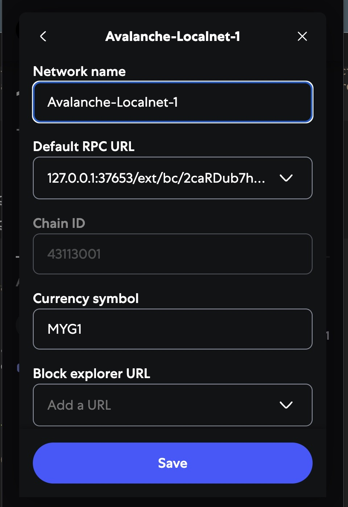

# Deployment of Avalanche L1 Chains + Mint NFT + Transfer Token

## 1. Deployment L1 Chain

### 1.1. Deploy localnet Avalanche L1 chains

- Create Container (**Notice: We recommend using a clean environment for demonstrations so that you can clean up.**)

```bash
docker kill avalanche-localnet; docker rm avalanche-localnet 

# Run the container.
docker run -d \
--platform linux/amd64 \
--name avalanche-localnet \
--restart unless-stopped \
--network host \
--entrypoint bash registry.cn-shenzhen.aliyuncs.com/wl4g/avalanche-local-base:v1.13.0 \
-c 'tail -f /dev/null'

# Enter the container.
docker exec -ti avalanche-localnet bash
```

- Initial Chain (**Notice: If avalanche-cli downloads dependencies for a timeout, we can manually download the binraries and copy and install it.**), see: [https://build.avax.network/docs/tooling/create-avalanche-l1](https://build.avax.network/docs/tooling/create-avalanche-l1)

- **Notice: Custom the define chain IDs must without registered only. e.g. You can go to [chainlist.org](https://chainlist.org/?testnets=true&search=fuji) to check it**

```bash
avalanche-cli blockchain create mygames1 --evm --latest --evm-chain-id 43113001 --evm-token MGA1 --evm-defaults --proof-of-authority
avalanche-cli blockchain create mygames2 --evm --latest --evm-chain-id 43113002 --evm-token MGA2 --evm-defaults --proof-of-authority
#✔ Proof Of Authority
#✔ Get address from an existing stored key (created from avalanche key create or avalanche key import)
#✔ ewoq
#✓ Validator Manager Contract owner address 0x8db97C7cEcE249c2b98bDC0226Cc4C2A57BF52FC
#prefunding address 0xD7e194aBC35B6F4896a1a98b64b15EDc10f309d4 with balance 1000000000000000000000000
#Installing subnet-evm-v0.7.3...
#subnet-evm-v0.7.3 installation successful
#File /root/.avalanche-cli/subnets/mygames1/chain.json successfully written
#✓ Successfully created blockchain configuration
#Run 'avalanche blockchain describe' to view all created addresses and what their roles are
```

- Deploy Chain: Execution and Start up

```bash
avalanche-cli blockchain deploy mygames1 --local --teleporter-version v1.0.0 --relayer-version icm-relayer-v1.6.3 --icm-version v1.0.0
avalanche-cli blockchain deploy mygames2 --local --teleporter-version v1.0.0 --relayer-version icm-relayer-v1.6.3 --icm-version v1.0.0
```

- 

### 1.2. Deploy localnet describe `MyGames1` or `MyGames2`

```bash
avalanche-cli blockchain describe mygames1 # mygames2

#+---------------------------------------------------------------------------------------------------------------------------------+
#|                                                             MYGAMES1                                                            |
#+---------------+-----------------------------------------------------------------------------------------------------------------+
#| Name          | mygames1                                                                                                        |
#+---------------+-----------------------------------------------------------------------------------------------------------------+
#| VM ID         | qDNbeu87sHXfCs4PaQSN2dGdkb843nxvxg2HBj4mkfZZQE4tc                                                               |
#+---------------+-----------------------------------------------------------------------------------------------------------------+
#| VM Version    | v0.7.3                                                                                                          |
#+---------------+-----------------------------------------------------------------------------------------------------------------+
#| Validation    | Proof Of Authority                                                                                              |
#+---------------+--------------------------+--------------------------------------------------------------------------------------+
#| Local Network | ChainID                  | 43113001                                                                             |
#|               +--------------------------+--------------------------------------------------------------------------------------+
#|               | SubnetID                 | 2W9boARgCWL25z6pMFNtkCfNA5v28VGg9PmBgUJfuKndEdhrvw                                   |
#|               +--------------------------+--------------------------------------------------------------------------------------+
#|               | Owners (Threhold=1)      | P-custom18jma8ppw3nhx5r4ap8clazz0dps7rv5u9xde7p                                      |
#|               +--------------------------+--------------------------------------------------------------------------------------+
#|               | BlockchainID (CB58)      | 2caRDub7hM6oEfiA8S9tfjbD56e65K2FhMtRbP2ns1MvL7EgWu                                   |
#|               +--------------------------+--------------------------------------------------------------------------------------+
#|               | BlockchainID (HEX)       | 0xd479e3d0a2cbd6ddbe09ac0ca4c720f6031828782b3b8b20670b9a2fb320254f                   |
#|               +--------------------------+--------------------------------------------------------------------------------------+
#|               | RPC Endpoint             | http://127.0.0.1:37653/ext/bc/2caRDub7hM6oEfiA8S9tfjbD56e65K2FhMtRbP2ns1MvL7EgWu/rpc |
#+---------------+--------------------------+--------------------------------------------------------------------------------------+
#
#+------------------------------------------------------------------------------------+
#|                                         ICM                                        |
#+---------------+-----------------------+--------------------------------------------+
#| Local Network | ICM Messenger Address | 0x253b2784c75e510dD0fF1da844684a1aC0aa5fcf |
#|               +-----------------------+--------------------------------------------+
#|               | ICM Registry Address  | 0xb6DC240Bb2B5E1a7c236110799B558599a5cF724 |
#+---------------+-----------------------+--------------------------------------------+
#
#+---------------------------+
#|           TOKEN           |
#+--------------+------------+
#| Token Name   | MGA1 Token |
#+--------------+------------+
#| Token Symbol | MGA1       |
#+--------------+------------+
#
#+----------------------------------------------------------------------------------------------------------------------------------------+
#|                                                        INITIAL TOKEN ALLOCATION                                                        |
#+-------------------------+------------------------------------------------------------------+---------------+---------------------------+
#| DESCRIPTION             | ADDRESS AND PRIVATE KEY                                          | AMOUNT (MGA1) | AMOUNT (WEI)              |
#+-------------------------+------------------------------------------------------------------+---------------+---------------------------+
#| Main funded account     | 0xD7e194aBC35B6F4896a1a98b64b15EDc10f309d4                       | 1000000       | 1000000000000000000000000 |
#| subnet_mygames1_airdrop | 6281aa1df51385499d13df803739221d769d558174114799a6f9ae83de22c67a |               |                           |
#+-------------------------+------------------------------------------------------------------+---------------+---------------------------+
#| Used by ICM             | 0x6ba6E8926Df4fC272a3267d533e215b272a70Bf5                       | 600           | 600000000000000000000     |
#| cli-teleporter-deployer | b7f093f4831da456ebb506fba7da77502edf4cd0aa400bd1622840439e4b52be |               |                           |
#+-------------------------+------------------------------------------------------------------+---------------+---------------------------+
#| Main funded account     | 0x8db97C7cEcE249c2b98bDC0226Cc4C2A57BF52FC                       | 10            | 10000000000000000000      |
#| ewoq                    | 56289e99c94b6912bfc12adc093c9b51124f0dc54ac7a766b2bc5ccf558d8027 |               |                           |
#+-------------------------+------------------------------------------------------------------+---------------+---------------------------+
#
#+----------------------------------------------------------------------------------------------------------------------------------+
#|                                                          SMART CONTRACTS                                                         |
#+----------------------------------------+--------------------------------------------+--------------------------------------------+
#| DESCRIPTION                            | ADDRESS                                    | DEPLOYER                                   |
#+----------------------------------------+--------------------------------------------+--------------------------------------------+
#| Transparent Proxy                      | 0x0Feedc0de0000000000000000000000000000000 |                                            |
#+----------------------------------------+--------------------------------------------+--------------------------------------------+
#| Validator Messages Lib                 | 0x9C00629cE712B0255b17A4a657171Acd15720B8C |                                            |
#+----------------------------------------+--------------------------------------------+--------------------------------------------+
#| Proxy Admin                            | 0xC0fFEE1234567890aBCdeF1234567890abcDef34 | 0x8db97C7cEcE249c2b98bDC0226Cc4C2A57BF52FC |
#+----------------------------------------+--------------------------------------------+--------------------------------------------+
#| ACP99 Compatible PoA Validator Manager | 0x0C0DEbA5E0000000000000000000000000000000 |                                            |
#+----------------------------------------+--------------------------------------------+--------------------------------------------+
#
#+----------------------------------------------------------------------+
#|                      INITIAL PRECOMPILE CONFIGS                      |
#+------------+-----------------+-------------------+-------------------+
#| PRECOMPILE | ADMIN ADDRESSES | MANAGER ADDRESSES | ENABLED ADDRESSES |
#+------------+-----------------+-------------------+-------------------+
#| Warp       | n/a             | n/a               | n/a               |
#+------------+-----------------+-------------------+-------------------+
#
#+--------------------------------------------------------------------------------------------------+
#|                                         MYGAMES1 RPC URLS                                        |
#+-----------+--------------------------------------------------------------------------------------+
#| Localhost | http://127.0.0.1:37653/ext/bc/2caRDub7hM6oEfiA8S9tfjbD56e65K2FhMtRbP2ns1MvL7EgWu/rpc |
#+-----------+--------------------------------------------------------------------------------------+
#
#+------------------------------------------------------------------+
#|                           PRIMARY NODES                          |
#+------------------------------------------+-----------------------+
#| NODE ID                                  | LOCALHOST ENDPOINT    |
#+------------------------------------------+-----------------------+
#| NodeID-7Xhw2mDxuDS44j42TCB6U5579esbSt3Lg | http://127.0.0.1:9650 |
#+------------------------------------------+-----------------------+
#| NodeID-MFrZFVCXPv5iCn6M9K6XduxGTYp891xXZ | http://127.0.0.1:9652 |
#+------------------------------------------+-----------------------+
#+------------------------------------------------------------------------------+
#|                                   L1 NODES                                   |
#+------------------------------------------+------------------------+----------+
#| NODE ID                                  | LOCALHOST ENDPOINT     | L1       |
#+------------------------------------------+------------------------+----------+
#| NodeID-HJh6GFYPPvLbcrTEGLtnk7KnJW3m5rk3A | http://127.0.0.1:37653 | mygames1 |
#+------------------------------------------+------------------------+----------+
#
#+--------------------------------------------------------------------------------------------------------+
#|                                            WALLET CONNECTION                                           |
#+-----------------+--------------------------------------------------------------------------------------+
#| Network RPC URL | http://127.0.0.1:37653/ext/bc/2caRDub7hM6oEfiA8S9tfjbD56e65K2FhMtRbP2ns1MvL7EgWu/rpc |
#+-----------------+--------------------------------------------------------------------------------------+
#| Network Name    | mygames1                                                                             |
#+-----------------+--------------------------------------------------------------------------------------+
#| Chain ID        | 43113001                                                                             |
#+-----------------+--------------------------------------------------------------------------------------+
#| Token Symbol    | MGA1                                                                                 |
#+-----------------+--------------------------------------------------------------------------------------+
#| Token Name      | MGA1 Token                                                                           |
#+-----------------+--------------------------------------------------------------------------------------+
```

- 

### 1.3. Deploy localnet chains listing

```bash
avalanche-cli blockchain list
+----------+----------+----------+---------------------------------------------------+------------+------------+-----------+
|  SUBNET  |  CHAIN   | CHAINID  |                       VMID                        |    TYPE    | VM VERSION | FROM REPO |
+----------+----------+----------+---------------------------------------------------+------------+------------+-----------+
| mygames1 | mygames1 | 43113001 | qDNbeu87sHXfCs4PaQSN2dGdkb843nxvxg2HBj4mkfZZQE4tc | Subnet-EVM | v0.7.3     | false     |
+----------+----------+----------+---------------------------------------------------+------------+------------+-----------+
| mygames2 | mygames2 | 43113002 | qDNbeu87sHaHvNBDN8K2epBvD7WAziU1hkMFCN8zFZoicnjjy | Subnet-EVM | v0.7.3     | false     |
+----------+----------+----------+---------------------------------------------------+------------+------------+-----------+
```

- 

## 2. Verification Basic Transactions

### 2.1. Add localnet to Metamask

- 

### 2.2. Send native Token to Matamask account from Prefunding account

- 2.2.1 Set up you created the temporary EVM Accounts on Metamask and RPC URLs to environment for after transactions Demo.

```bash
# Created Own Test EOA account 1 on Metamask
export TEST_ACCOUNT_KEY_1=0x7bf00a22957531afd8cd99caf21c2090967a42cf2d26a03dfb55ec2dcc2ee118
export TEST_ACCOUNT_ADDR_1=0xE3264679734A5d57E3ffb29905b1db37F9E418f9

# Created Pre-funded Initial EOA account 1 by Avalanche
export INIT_ACCOUNT_KEY_1=0x6281aa1df51385499d13df803739221d769d558174114799a6f9ae83de22c67a
export INIT_ACCOUNT_ADDR_1=0xD7e194aBC35B6F4896a1a98b64b15EDc10f309d4

# Deployed Avalanche local L1 chain RPC URL 1
export CHAIN_ID_1=43113001
export CHAIN_RPC_URL_1='http://127.0.0.1:37653/ext/bc/2caRDub7hM6oEfiA8S9tfjbD56e65K2FhMtRbP2ns1MvL7EgWu/rpc'

# Prevent to .env to more than high priority.
export PRIVATE_KEY=${TEST_ACCOUNT_KEY_1}
```

- 2.2.2 Sent the `100000MYG1` Native Token to Own EOA Account 1

```bash
cast send \
--from ${INIT_ACCOUNT_ADDR1} \
--value 100000ether \
--private-key ${INIT_ACCOUNT_KEY_1} \
--rpc-url ${CHAIN_RPC_URL_1} \
--chain=${CHAIN_ID_1} \
${TEST_ACCOUNT_ADDR_1}
```

- 

### 2.3. View Account Native Token balance with Commands or Metamask UI

```bash
cast balance \
--rpc-url ${CHAIN_RPC_URL_1} \
--ether \
${TEST_ACCOUNT_ADDR_1}
#10000MYG1
```

- 

## 3. NFT Deploy & Verification

### 3.1. Deploy NFT contract with Initial Account1

```bash
forge script script/DeployMyGamesNft.s.sol:DeployMyGamesNft \
--private-key ${INIT_ACCOUNT_KEY_1} \
--rpc-url ${CHAIN_RPC_URL_1} \
--chain=43113001 \
--broadcast -vvvv

#[⠊] Compiling...
#No files changed, compilation skipped
#Traces:
#  [2497435] DeployMyGamesNft::run()
#    ├─ [0] VM::envUint("PRIVATE_KEY") [staticcall]
#    │   └─ ← [Return] <env var value>
#    ├─ [0] VM::startBroadcast(<pk>)
#    │   └─ ← [Return] 
#    ├─ [2452207] → new MyGamesNft@0x49e43386EBdf8ab841131e5fFB613DAf9F54e83a
#    │   └─ ← [Return] 11908 bytes of code
#    ├─ [0] VM::stopBroadcast()
#    │   └─ ← [Return] 
#    └─ ← [Stop] 
#Script ran successfully.
### Setting up 1 EVM.
#==========================
#Simulated On-chain Traces:
#  [2452207] → new MyGamesNft@0x49e43386EBdf8ab841131e5fFB613DAf9F54e83a
#    └─ ← [Return] 11908 bytes of code
#==========================
#Chain 43113001
#Estimated gas price: 50.000000001 gwei
#Estimated total gas used for script: 3517957
#Estimated amount required: 0.175897850003517957 ETH
#==========================
###### 43113001
#✅  [Success] Hash: 0x3570d8999bb02aa41291c2e78f3130f87e8113544676002e7a308c5b672ce9dd
#Contract Address: 0x49e43386EBdf8ab841131e5fFB613DAf9F54e83a
#Block: 10
#Paid: 0.067653025002706121 ETH (2706121 gas * 25.000000001 gwei)
#✅ Sequence #1 on 43113001 | Total Paid: 0.067653025002706121 ETH (2706121 gas * avg 25.000000001 gwei)
#==========================
#ONCHAIN EXECUTION COMPLETE & SUCCESSFUL.
#Transactions saved to: .../avalanche-selfhosting-poc/broadcast/DeployMyGamesNft.s.sol/43113001/run-latest.json
#Sensitive values saved to: .../avalanche-selfhosting-poc/cache/DeployMyGamesNft.s.sol/43113001/run-latest.json
```

- 

### 3.2. Import NFT contract to Metamask

- 

### 3.3. Mint NFT to Initial Account1 on `MyGames1`

```bash
cast send \
--private-key=${INIT_ACCOUNT_KEY_1} \
--rpc-url=${CHAIN_RPC_URL_1} \
--chain=43113001 \
--legacy \
0x49e43386EBdf8ab841131e5fFB613DAf9F54e83a \
"mint(address)" "${TEST_ACCOUNT_ADDR_1}"

#blockHash            0x39eef52faeef719193371bed796932f4793e2686c8c30860e33e687bf5ac7838
#blockNumber          11
#contractAddress      
#cumulativeGasUsed    91547
#effectiveGasPrice    25000000001
#from                 0xD7e194aBC35B6F4896a1a98b64b15EDc10f309d4
#gasUsed              91547
#logs                 [{"address":"0x49e43386ebdf8ab841131e5ffb613daf9f54e83a","topics":["0xddf252ad1be2c89b69c2b068fc378daa952ba7f163c4a11628f55a4df523b3ef","0x0000000000000000000000000000000000000000000000000000000000000000","0x0000000000000000000000009b3b36bc9cc6a128937870714a8b856b71773914","0x0000000000000000000000000000000000000000000000000000000000000001"],"data":"0x","blockHash":"0x39eef52faeef719193371bed796932f4793e2686c8c30860e33e687bf5ac7838","blockNumber":"0xb","transactionHash":"0x07d7a25e884c6ac16325daa17e27ce1c01909f251b3786f0d81a275a37fa907e","transactionIndex":"0x0","logIndex":"0x0","removed":false}]
#logsBloom            0x00000000000000000000000000000000000000000000000000000000000000000000000000000000000000000000000000000000000000000000000000040000000000000004000000000008000000000000000000040000000000000000000000000000060000000000000000000800000000000000800000000010000001000000000000000000000000000000000000000000000000000000000000000000000000000000000000000000000000000000000000000000000000000000800000000002000000000000000000000000000000000000000000000000000060000000000000000000000000004000000000000000000000000000000000000000
#root                 
#status               1 (success)
#transactionHash      0x07d7a25e884c6ac16325daa17e27ce1c01909f251b3786f0d81a275a37fa907e
#transactionIndex     0
#type                 0
#blobGasPrice         
#blobGasUsed          
#authorizationList    
#to                   0x49e43386EBdf8ab841131e5fFB613DAf9F54e83a
```

- 

### 3.4. View NFT on Metamask

- 

## 4. ERC20 Deploy & Verification

### 4.1. Deploy ERC20 contract with Initial Account 1

```bash
forge script script/DeployMyGamesToken.s.sol:DeployMyGamesToken \
--private-key ${INIT_ACCOUNT_KEY_1} \
--rpc-url ${CHAIN_RPC_URL_1} \
--chain=43113001 \
--broadcast -vvvv
#0x4147b19c5E1ce4Fe5676318f82980E65b98beC19
```

- Set up ERC20 contract address

```bash
export CONTRACT_ERC20_1=0x4147b19c5E1ce4Fe5676318f82980E65b98beC19
```

### 4.2. Import ERC20 contract to Metamask

- 

### 4.3. Transfer ERC20 Token to Test Account 1 from Initial Account 1

```bash
cast send \
--private-key=${INIT_ACCOUNT_KEY_1} \
--rpc-url=${CHAIN_RPC_URL_1} \
--chain=${CHAIN_ID_1} \
--legacy \
${CONTRACT_ERC20_1} \
"transfer(address,uint256)" "${TEST_ACCOUNT_KEY_1}" 200000000000000000000
```

### 4.4. View ERC20 Token on Metamask

- 

## 5. Cross-chain Deploy & Verification

### 5.1. Deploy Cross-chain Contract with Initial Account 1

```bash
# Deploy on Chain 1
export PRIVATE_KEY=${INIT_ACCOUNT_KEY_1}
forge script script/DeployCrossChainMessager.s.sol:DeployCrossChainMessager --private-key ${PRIVATE_KEY} --rpc-url ${CHAIN_RPC_URL_1} --broadcast -vvvv
#Contract Address: 0x43fCeA273daAae38a25d1a1F9923271c5Fe1f7eb

# Deploy on Chain 2
export PRIVATE_KEY=${INIT_ACCOUNT_KEY_2}
forge script script/DeployCrossChainMessager.s.sol:DeployCrossChainMessager --private-key ${PRIVATE_KEY} --rpc-url ${CHAIN_RPC_URL_2} --broadcast -vvvv
#Contract Address: 0xA05F7A195D2a775df69d99FB86C09BF769b76305
```

### 5.2. Verify Cross-Chain Messages (ICM)

Approach 1: Tell chain-chain messages with avalanche-cli

```bash
avalanche-cli teleporter sendMsg mygames1 mygames2 "Hello 101" --destination-address 0xA05F7A195D2a775df69d99FB86C09BF769b76305 --local
```

- Approach 2: Tell chain-chain messages with foundry

```bash
export CHAIN_ID_2_HEX=$(avalanche-cli blockchain describe mygames2 | grep 'BlockchainID (HEX)' | awk -F '|' '{print $4}' | sed 's/ //g')
cast send \
--private-key ${TEST_ACCOUNT_KEY_1} \
--rpc-url ${CHAIN_RPC_URL_1} \
0x43fCeA273daAae38a25d1a1F9923271c5Fe1f7eb \
"sendTeleportMessage(bytes32,address,string)" ${CHAIN_ID_2_HEX} 0xA05F7A195D2a775df69d99FB86C09BF769b76305 "Hello 101"

# View the destination chain contract variable lastMessage
cast call \
--rpc-url ${CHAIN_RPC_URL_2} \
0xA05F7A195D2a775df69d99FB86C09BF769b76305 "lastMessage()(string)"
#"Hello 101"
```

## 6. FAQ

### 6.1 Do interchain/cross-chain messages requires pay fee to ICM Relayer ?

- ***Allow fee can be 0***, The below sources code comments of avalanche teleporter contract see: [TeleporterMessenger.sol#L644-L645](https://github.com/ava-labs/icm-contracts/blob/57796c8d6c5fc7ac984b492b93233cf083ea8381/contracts/teleporter/TeleporterMessenger.sol#L644-L645)

```solidity
// If the fee amount is non-zero, transfer the asset into control of this TeleporterMessenger contract instance.
// The fee is allowed to be 0 because it's possible for someone to run their own relayer and deliver their own messages,
// which does not require further incentivization. They still must pay the transaction fee to submit the message, so
// this is not a DOS vector in terms of being able to submit zero-fee messages.
```

### 6.2 Teleporter contracts Cross-chain/Interchain receiving messages principles ?

- [TeleporterMessenger.sol#L327-L328](https://github.com/ava-labs/icm-contracts/blob/57796c8d6c5fc7ac984b492b93233cf083ea8381/contracts/teleporter/TeleporterMessenger.sol#L327-L328)

```solidity
function receiveCrossChainMessage(uint32 messageIndex, address relayerRewardAddress) external receiverNonReentrant {
    // ...
    // Parse the payload of the message.
    TeleporterMessage memory teleporterMessage = abi.decode(warpMessage.payload, (TeleporterMessage));
    // ...
    bytes32 messageID = calculateMessageID(warpMessage.sourceChainID, blockchainID_, teleporterMessage.messageNonce);
    // ...
    // Execute the message.
    if (teleporterMessage.message.length > 0) 
        _handleInitialMessageExecution(messageID, warpMessage.sourceChainID, teleporterMessage);
    }
}
function _handleInitialMessageExecution(bytes32 messageID, bytes32 sourceBlockchainID, TeleporterMessage memory message) private {
    // ...
    // Encode the payload by ABI encoding a call to the {receiveTeleporterMessage} function defined by the {ITeleporterReceiver} interface.
    bytes memory payload = abi.encodeCall(ITeleporterReceiver.receiveTeleporterMessage, (sourceBlockchainID, message.originSenderAddress, message.message));
    // ...
    // Call the destination address of the message with the formatted call data. Only provide the required 
    // gas limit to the sub-call so that the end application cannot consume an arbitrary amount of gas.
    bool success = _tryExecuteMessage(message.destinationAddress, message.requiredGasLimit, payload);
    // ...
}
function _tryExecuteMessage(address target, uint256 gasLimit, bytes memory payload) private returns (bool) {
    // Call the destination address of the message with the provided payload and amount of gas.
    //
    // Assembly is used for the low-level call to avoid unnecessary expansion of the return data in memory.
    // This prevents possible "return bomb" vectors where the external contract could force the caller
    // to use an arbitrary amount of gas. See Solidity issue here: https://github.com/ethereum/solidity/issues/12306
    bool success;
    assembly { // solhint-disable-next-line no-inline-assembly
        success := call(gasLimit, // gas provided to the call
                target, // call target
                0, // zero value
                add(payload, 0x20), // input data - 0x20 needs to be added to an array because the first 32-byte slot contains the array length (0x20 in hex is 32 in decimal).
                mload(payload), // input data size - mload returns mem[p..(p+32)], which is the first 32-byte slot of the array. In this case, the array length.
                0, // output
                0 // output size
        )
    }
    return success;
}
```

### 6.3 How does convert BlockchainID to Hex from Avalanche cb58 string ?

```bash
avalanche-cli blockchain describe mygames1 | grep 'BlockchainID (CB58)' | awk -F '|' '{print $4}' | sed 's/ //g'
#ZzzW9nfB6BRz5tCjweRMvCx4gjVkUdXsrzhLtxxgtfjQPuEwU

cat <<EOF > /tmp/decode_cb58.py
import sys
import base58

def cb58_decode(cb58_str):
    decoded = base58.b58decode(cb58_str)
    data = decoded[:-4] # Remove checksum (tail 4 bytes)
    return data

if __name__ == "__main__":
    if len(sys.argv) != 2:
        print("Usage: python decode_cb58.py <CB58_STRING>")
        sys.exit(1)
    
    cb58_str = sys.argv[1]
    try:
        decoded = cb58_decode(cb58_str)
        hex_str = "0x" + decoded.hex()
        print(hex_str)
    except Exception as e:
        print(f"Error: {e}", file=sys.stderr)
        sys.exit(1)
EOF

python /tmp/decode_cb58.py ZzzW9nfB6BRz5tCjweRMvCx4gjVkUdXsrzhLtxxgtfjQPuEwU
#0x4aee21ab8bbad20c34315a5b0f8a3588ccc335e8194f4f655eba79ad08ea448c
```

### How to view Revert error function signature ?

- for example error message: `Error: server returned an error response: error code 3: execution reverted, data: "0xe450d38c00000000000000000000000043a2a4c9c36ef605861aa54e15054a77b39cf91a00000000000000000000000`

- Online Converter see: [https://www.4byte.directory/signatures/?bytes4_signature=0xe450d38c](https://www.4byte.directory/signatures/?bytes4_signature=0xe450d38c) as `Text Signature: ERC20InsufficientBalance(address,uint256,uint256)`

### 6.5 How to view logs for Troubleshooting ?

```bash
tail -f ~/.avalanche-cli/logs/avalanche.log
tail -f ~/.avalanche-cli/logs/signature-aggregator.log 
tail -f ~/.avalanche-cli/runs/LocalNetwork/local-relayer/icm-relayer.log
tail -f ~/.avalanche-cli/runs/network_20250511_061155/NodeID-7Xhw2mDxuDS44j42TCB6U5579esbSt3Lg/logs/main.log
tail -f ~/.avalanche-cli/runs/awm-relayer.log
```
